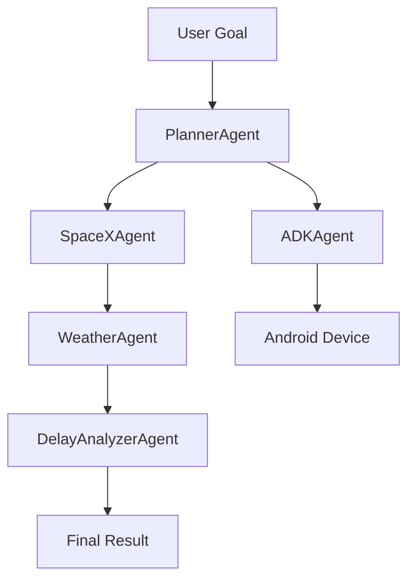

# 🚀 Multi-Agent AI System Using Google ADK

A multi-agent AI system that takes a user goal, plans task routing, and coordinates agents to fulfill the goal using real-time data and public APIs. Built in Python with modular, chainable agents.

## 📋 Table of Contents
- [Features](#-features)
- [Architecture](#-architecture-overview)
- [Setup](#-setup-instructions)
- [Usage](#-usage)
- [Development](#-development)
- [Testing](#-testing)
- [API Documentation](#-api-documentation)
- [Contributing](#-contributing)
- [License](#-license)

## ✨ Features

- 🤖 **Modular Agent System**: Each agent is independent and chainable
- 📱 **Android Device Integration**: Seamless communication with Android devices using Google ADK
- 🌐 **Real-time Data**: Integration with SpaceX and Weather APIs
- 🔄 **Task Planning**: Intelligent task routing based on user goals
- 📊 **Logging & Monitoring**: Comprehensive logging system for debugging and monitoring
- 🧪 **Evaluation Framework**: Built-in test cases and evaluation system
- 🔒 **Error Handling**: Robust error handling and recovery mechanisms

## 🧠 Architecture Overview

### Core Components

- **PlannerAgent**: Parses user goals and determines agent execution order
- **SpaceXAgent**: Fetches data about upcoming SpaceX launches
- **WeatherAgent**: Retrieves weather data for specific locations
- **DelayAnalyzerAgent**: Analyzes weather conditions for launch delays
- **ADKAgent**: Manages communication with Android devices

### System Flow



## 🔧 Setup Instructions

### Prerequisites

- Python 3.8 or higher
- Android device with USB debugging enabled
- Google ADK development kit
- OpenWeatherMap API key

### Installation

1. **Clone the Repository**
   ```bash
   git clone <your-repo-url>
   cd <your-project-folder>
   ```

2. **Create Virtual Environment**
   ```bash
   python -m venv .venv
   source .venv/bin/activate  # On Windows: .venv\Scripts\activate
   ```

3. **Install Dependencies**
   ```bash
   pip install -r requirements.txt
   ```

4. **Environment Setup**
   Create a `.env` file in the root directory:
   ```env
   OPENWEATHER_API_KEY=your_api_key_here
   ```

## ▶️ Usage

### Running the System

```bash
python main.py
```

The system offers three modes:
1. **Manual Mode**: Run with predefined goals
2. **ADK Tasks**: Execute Android device-specific tasks
3. **Evaluations**: Run test cases and evaluations

### Example Goals

1. **SpaceX Launch Check**
   ```
   "Find the next SpaceX launch, check weather at that location, then summarize if it may be delayed."
   ```

2. **Android Device Communication**
   ```
   "Connect to Android device and send test data"
   ```

## 💻 Development

### Project Structure
```
.
├── agents/              # Agent implementations
│   ├── base_agent.py    # Base agent class
│   ├── planner_agent.py # Task planning agent
│   ├── spacex_agent.py  # SpaceX data agent
│   ├── weather_agent.py # Weather data agent
│   └── delay_analyzer.py # Delay analysis agent
├── core/               # Core system components
│   ├── agent_manager.py # Agent coordination
│   └── google_adk_manager.py # ADK integration
├── evals/              # Test cases and evaluations
├── android_app/        # Android application code
├── main.py            # Main entry point
└── requirements.txt    # Project dependencies
```

### Adding New Agents

1. Create a new agent class inheriting from `BaseAgent`
2. Implement the required `run()` method
3. Add the agent to the planner's task recognition
4. Update test cases if necessary

## 🧪 Testing

### Running Tests
```bash
python main.py --mode 3  # Run evaluation mode
```

### Test Cases
Test cases are defined in `evals/test_cases.json`:
```json
{
  "goal": "Find next SpaceX launch",
  "expected_keys": ["launch_data", "weather_data", "delay_analysis"]
}
```

## 📚 API Documentation

### SpaceX API
- **Base URL**: `https://api.spacexdata.com/v4`
- **Endpoint**: `/launches/next`
- **Authentication**: None required
- **Rate Limits**: No official limits

### OpenWeatherMap API
- **Base URL**: `https://api.openweathermap.org/data/2.5`
- **Endpoint**: `/weather`
- **Authentication**: API Key required
- **Rate Limits**: 60 calls/minute (free tier)

### Google ADK
- **Protocol**: USB
- **Requirements**: Android device with USB debugging
- **Features**: Bidirectional communication

## 🤝 Contributing

1. Fork the repository
2. Create a feature branch
3. Commit your changes
4. Push to the branch
5. Create a Pull Request

### Development Guidelines
- Follow PEP 8 style guide
- Add type hints to all functions
- Include docstrings for all classes and methods
- Write tests for new features
- Update documentation as needed

## 📝 License

This project is licensed under the MIT License - see the LICENSE file for details.

## 🔍 Troubleshooting

### Common Issues

1. **ADK Connection Issues**
   - Ensure USB debugging is enabled
   - Check USB cable connection
   - Verify device drivers are installed

2. **API Rate Limits**
   - Implement caching for API responses
   - Use exponential backoff for retries
   - Monitor API usage

3. **Logging**
   - Check `app.log` for detailed error information
   - Enable debug logging for more verbose output

## 📞 Support

For support, please:
1. Check the troubleshooting guide
2. Review the documentation
3. Open an issue on GitHub
4. Contact the development team

