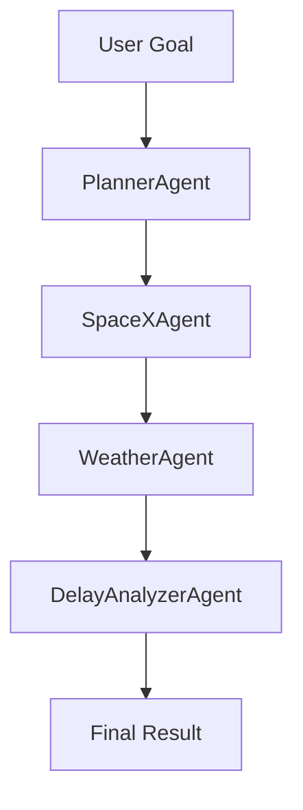

# 🚀 Multi-Agent AI System Using Google ADK

A multi-agent AI system that takes a user goal, plans task routing, and coordinates agents to fulfill the goal using real-time data and public APIs. Built in Python with modular, chainable agents.

---

## 📌 Goal

> **Example goal**:\
> “Find the next SpaceX launch, check weather at that location, then summarize if it may be delayed.”

---

## 🧠 Architecture Overview

- **PlannerAgent**: Parses the user goal and determines agent execution order.
- **SpaceXAgent**: Gets data about the next SpaceX launch.
- **WeatherAgent**: Fetches weather data based on launch location.
- **DelayAnalyzerAgent**: Analyzes weather conditions to predict delay.

---

## 🗂️ Directory Structure

```
.
├── agents/
│   ├── base_agent.py
│   ├── planner_agent.py
│   ├── spacex_agent.py
│   ├── weather_agent.py
│   └── delay_analyzer.py
├── core/
│   └── agent_manager.py
├── evals/
│   └── test_cases.json
├── main.py
├── .env
├── .env.example
└── README.md
```

---

## 🔧 Setup Instructions

### 1. Clone the Repo

```bash
git clone <your-repo-url>
cd <your-project-folder>
```

### 2. Install Dependencies

```bash
pip install -r requirements.txt
```

### 3. Create `.env` File

Create a `.env` file in the root folder:

```env
OPENWEATHER_API_KEY=your_api_key_here
```

---

## ▶️ How to Run

```bash
python main.py
```

Example Output:

```txt
Planned tasks: ['SpaceXAgent', 'WeatherAgent', 'DelayAnalyzerAgent']
📅 Final Result: Delay likely: False based on condition: Clouds
```

---

## 🧪 Evaluation

- **Eval Case**: `evals/test_cases.json` contains structured input & expected agent routes.
- Agents are chained correctly and enrich results based on previous outputs.
- System retries if key information is missing.

---

## 🔍 APIs Used

- [SpaceX API](https://github.com/r-spacex/SpaceX-API) – next launch info
- [OpenWeatherMap API](https://openweathermap.org/api) – live weather at launch site

---

## 📊 Agent Logic & Flow



---

## ✅ Features

- Modular agent design
- Chained data enrichment
- Real-world API integration
- Iterative logic if goal not satisfied

